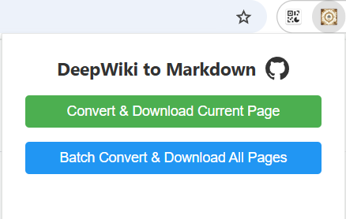
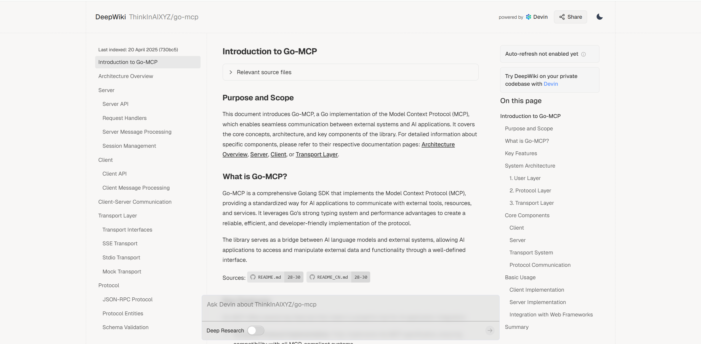
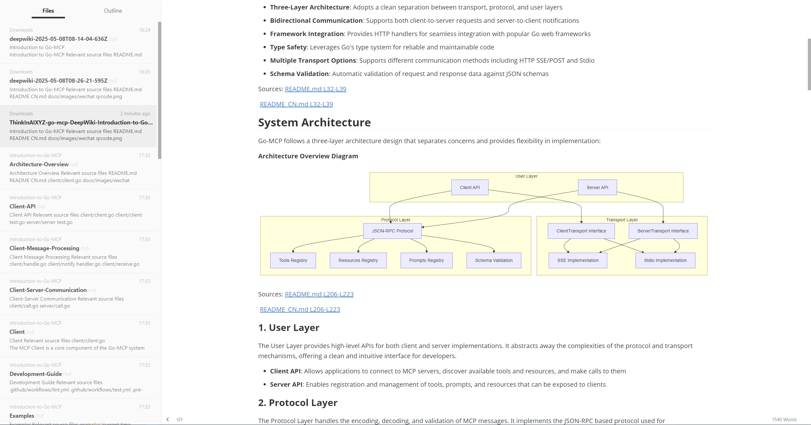

# DeepWiki Exporter

DeepWiki Exporter is a Chrome/Edge browser extension for exporting DeepWiki documentation to Markdown.

It supports both normal [DeepWiki](https://deepwiki.com) pages and DeepWiki-style documentation rendered inside Devin at `app.devin.ai`. You can export the current page as a `.md` file or batch-export a full wiki as a ZIP archive with one Markdown file per page.

## Features

- **Current-page export** — save the page you are viewing as a Markdown file.
- **Full-wiki export** — crawl the sidebar and download a ZIP containing all exported Markdown pages.
- **Devin wiki support** — handles Devin's single-page app wiki UI by clicking real sidebar entries instead of guessing URLs.
- **Nested sidebar support** — expands collapsed sections before batch export.
- **Lazy-content support** — scrolls pages so lazy-rendered sections, images, and diagrams have a chance to load before export.
- **Mermaid-aware output** — preserves Mermaid/diagram content as Markdown code blocks where possible.
- **Private by design** — conversion runs locally in the browser. The extension does not send content to an external server.
- **Offline ZIP packaging** — JSZip is bundled locally; no CDN code is loaded at runtime.

## Screenshots

### Extension popup



### Source DeepWiki page



### Exported Markdown output



## Install from GitHub

This extension is intended to be installed as an unpacked extension.

1. Clone the repository:

   ```bash
   git clone https://github.com/makiisthenes/deepwiki-exporter-extension.git
   cd deepwiki-exporter-extension
   ```

2. Open your browser extensions page:

   - Chrome: `chrome://extensions`
   - Edge: `edge://extensions`

3. Enable **Developer mode**.
4. Click **Load unpacked**.
5. Select the cloned `deepwiki-exporter-extension` folder.
6. Pin **DeepWiki Exporter** to your toolbar.

After pulling updates, return to the extensions page and click the extension card's **Reload** button.

## Usage

### Export the current page

1. Open a page on `deepwiki.com` or a Devin wiki page on `app.devin.ai`.
2. Click the **DeepWiki Exporter** toolbar icon.
3. Click **Convert & Download Current Page**.
4. Save the generated `.md` file.

### Export a full wiki

1. Open any page in the wiki you want to export.
2. Click the **DeepWiki Exporter** toolbar icon.
3. Click **Batch Convert & Download All Pages**.
4. Wait while the extension steps through the sidebar.
5. Save the generated ZIP file.

The ZIP contains:

- one Markdown file per exported wiki page
- a generated `README.md` index linking to each exported file

You can click **Cancel Batch Operation** to stop a batch run early.

## Supported sites

| Site | Strategy |
| --- | --- |
| `deepwiki.com` | Reads sidebar links and visits each URL. |
| `app.devin.ai` | Expands the sidebar, clicks each wiki navigation item in-place, waits for the content to update, scrolls to load lazy content, then exports. |

## Permissions

The extension requests only the permissions needed for the export workflow. It does not request `activeTab`, `storage`, or broad all-site host access:

| Permission | Why it is needed |
| --- | --- |
| `tabs` | Query/update the active tab during batch export. |
| `scripting` | Inject the content script when the current page has not loaded it yet. |
| `downloads` | Save generated `.md` and `.zip` files. |
| host permissions for `deepwiki.com` and `app.devin.ai` | Access wiki content on the supported sites so it can be converted locally. |

The extension is scoped to:

```json
[
  "https://deepwiki.com/*",
  "https://app.devin.ai/*"
]
```

## Project structure

```text
.
├── manifest.json       # Chrome extension manifest (MV3)
├── popup.html          # Toolbar popup UI
├── popup.js            # Popup actions and ZIP packaging
├── content.js          # Page extraction, sidebar crawling, Markdown conversion
├── background.js       # Extension service worker
├── styles.css          # Popup styles
├── lib/jszip.min.js    # Bundled ZIP library
├── icons/              # Extension icons
├── images/             # README/demo images
├── LICENSE
└── THIRD_PARTY_NOTICES.md
```

## Development notes

This is a plain Manifest V3 extension. There is no build step.

Useful local checks:

```bash
node --check background.js
node --check popup.js
node --check content.js
python -m json.tool manifest.json
```

If you change content extraction logic, test both:

- a normal `deepwiki.com` wiki
- a Devin-hosted wiki under `app.devin.ai`

## Privacy

DeepWiki Exporter does not define a remote backend and does not upload exported content. It reads supported wiki pages in the browser tab, converts the DOM to Markdown locally, and saves files using the browser downloads API.

## Limitations

- Large wikis can take time because pages are processed sequentially.
- Site UI changes on DeepWiki or Devin may require selector updates.
- Some complex diagrams or lazy-rendered components may need a second export attempt if the source page did not finish rendering.

## License

MIT. See [`LICENSE`](./LICENSE).

Third-party runtime dependency notices are listed in [`THIRD_PARTY_NOTICES.md`](./THIRD_PARTY_NOTICES.md).
